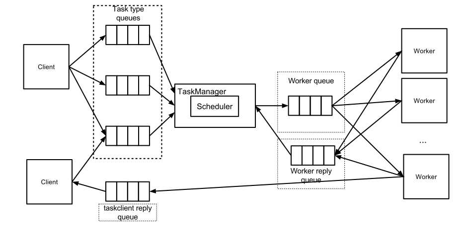

# Task Manager

The task manager is the central application through which all tasks are passed.
The task manager controls the priority of the tasks.
Tasks are grouped by the type of work that is performed.
Each type of work has it's own scheduler in the task manager and work independently from other work types.

## Concepts

* Task manager: The central application to set the priority of tasks.
* Client: A process that creates tasks to be run.
* Worker: A process that can run one or more tasks concurrently.
* Task Queue: The queue on which clients place their tasks.
Tasks Queues are grouped by the worker that can perform the task.
* Worker Queue: A single queue per worker type on which all workers listen for tasks.

## An Agile Approach

Unlike traditional schedulers the task manager doesn't control which worker does the work.
The task manager only knows how much workers are available.
Workers pick tasks from the queue based on a first-come-first-take principle.
Tasks remain on the queue until the workers acknowledge the task is done.
The task manager operates as a gatekeeper to the workers.
It sets priorities on the different tasks.
It guaranties that no matter how many tasks of a certain type are in the queue there is always room for other type of tasks.

## Task Flow

In the figure below an overview is given of how the clients, workers, queues and scheduler are connected.
 


The flow of a tasks is as follows:
1. A client puts a task on the task type queue within the work group.
The queue to put the job on depends on the type of task.
For example a web interface calculation for Calculator is put on the queue `aerius.calculator.calculator_ui`.
2. The taskmanagers listens to all client queues and takes a message from each queue if one is present.
3. When a worker starts listing to the worker queue it opens a RabbbitMQ channel for each process in the worker that can handle tasks.
For example a queue is named `aerius.worker.calculator`. Where `.worker` indicates that it's a worker queue.
4. The taskmanager counts the number of worker channels and to determine the available capacity.
This check is done with a fixed interval and the capacity is updated accordingly.
5. When a worker is available the taskmanager scheduler determines which task should be forwarded to a worker.
This is based on priority and maximum load for a given worker type.
6. The task is then send to the worker and the taskmanager keeps track of this task.
7. The taskmanager continues from step 2.
8. Once the task is finished the worker sends a reply via the work reply queue, e.g. `aerius.worker.calculator.reply`.
9. The taskmanager marks the tasks as finished and marks the worker as free.
A new task can now be scheduled.

## Configuration

The task manager configuration consists of 2 parts.

### General Configuration
The general configuration is needed to startup the task manager.
The configuration is set in a `.properties` file (e.g. `taskmanager.properties`) and has the following configuration options:

```
# RabbitMQ configuration. Commented out configuration has a default value.
broker.host = [RabbitMQ host]
# broker.port = [RabbitMQ port] # default 5672
broker.username = [RabbitMQ username]
broker.password = [RabbitMQ password]

# Taskmanager configuration directory. Directory should contain the queue configurations.
taskmanager.configuration.directory = [configuration files directory]

# Optional graphite metrics configuration:
metrics.graphite.host = [graphite host]
#metrics.graphite.port = [graphite port] # default: 2004
#metrics.graphite.interval = [update interval] # default: 5 seconds
```

### Queue Configuration
The queue configuration is done in json files.
These files need to be put in the directory configured in `taskmanager.configuration.directory`.
The task managers monitors this directory and updates the configuration on the fly if any of the files change.
This makes it possible to change the configuration while the task manager runs.
The json format of the configuration files is as follows:

```
{
  "workerQueueName": "<type of the queue>",
  "queues": [
    {
      "queueName": "<client queue name>",
      "priority": <int>,
      "maxCapacityUse": <value between 0 and 1>
    },
    ...
  ]
}
```

The parameter `workerQueueName` is required and should match the name related to the worker.
The task manager derives the full worker queue name from it.
So `ops` becomes the worker queue name: `aerius.worker.ops`.

In `queues` there can be 1 or more queue configurations.
Each queue configuration consists of 3 parameters:
* `queueName`: The postfix of the client queue of which the task manager constructs the full queue name using the worker queue name.
So `calculator_ui` becomes `aerius.ops.calculator_ui`, when the `workerQueueName` is `ops`.
* `priority`: A positive int value determining the priority of the tasks.
A lower number means a higher priority.
* `maxCapacityUse`: A number between 0 and 1 that limits the amount of tasks that are concurrently run for the queue based on the available number of workers.
For example if the value is `0.6` and there are `10` workers.
This would mean a maximum of `6` workers will be given a tasks from this queue.


## Building the Task Manager

To build the task manager java and maven are needed.
In the `source` directory run:

```
mvn clean install
```

## Running the Task Manager

```
java -jar taskmanager-<version>.jar -config taskmanager.properties`
```

## Docker

To run the task manager in Docker a Dockerfile and configuration is distributed in this repository.
